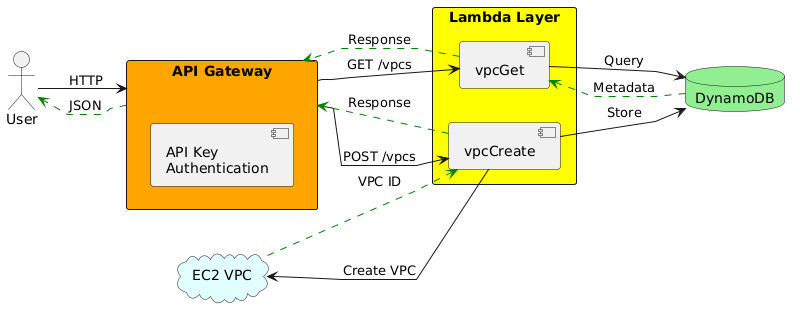

# VPC Management API

A api for managing VPC and subnets. 

For api details: Please refer open api spec file 

## Architecture

## Running the service

1. Create a S3 Bucket
2. Update the env variables in env.local.sh
3. Configure aws cli
4. Run source env.local.sh
5. Run make package
6. Run Make deploy and start testing the api. 
7. Run make remove to destroy the created infra.

> Note: Have also included api.rest file for testing via code editor
